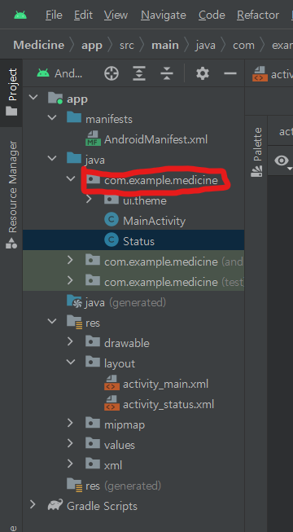
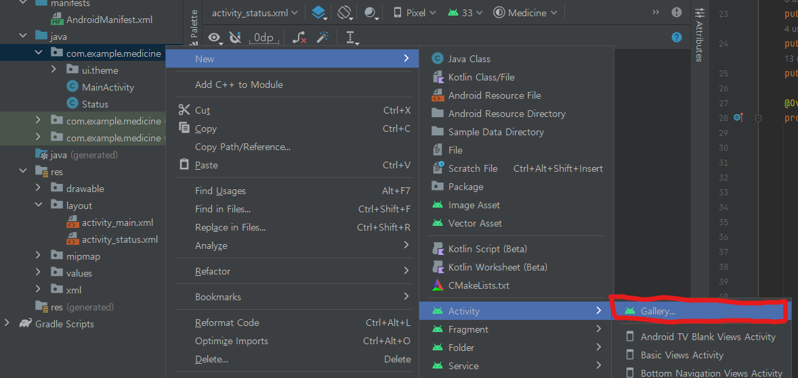
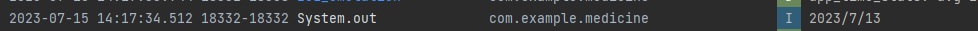

# Medicine
made for mom

# Medicine 프로젝트

## 목차

1. [Annotation/어노테이션](#Annotation/어노테이션)
2. [Activity/창 전환 기능](#2)
3. [Spinner/스피너(콤보박스)](Medicine%20%E1%84%91%E1%85%B3%E1%84%85%E1%85%A9%E1%84%8C%E1%85%A6%E1%86%A8%E1%84%90%E1%85%B3%2084cf7be3c2314988bbb6034a11558a26/%E1%84%82%E1%85%A2%E1%84%8B%E1%85%AD%E1%86%BC%202713fd65ac054a3d992a126cff59978b.md)
4. [에러 android.content.res.Resources$NotFoundException](Medicine%20%E1%84%91%E1%85%B3%E1%84%85%E1%85%A9%E1%84%8C%E1%85%A6%E1%86%A8%E1%84%90%E1%85%B3%2084cf7be3c2314988bbb6034a11558a26/%E1%84%82%E1%85%A2%E1%84%8B%E1%85%AD%E1%86%BC%202713fd65ac054a3d992a126cff59978b.md)
5. [현재 시간 가져오기](Medicine%20%E1%84%91%E1%85%B3%E1%84%85%E1%85%A9%E1%84%8C%E1%85%A6%E1%86%A8%E1%84%90%E1%85%B3%2084cf7be3c2314988bbb6034a11558a26/%E1%84%82%E1%85%A2%E1%84%8B%E1%85%AD%E1%86%BC%202713fd65ac054a3d992a126cff59978b.md)
6. [logcat/로그캣출력](Medicine%20%E1%84%91%E1%85%B3%E1%84%85%E1%85%A9%E1%84%8C%E1%85%A6%E1%86%A8%E1%84%90%E1%85%B3%2084cf7be3c2314988bbb6034a11558a26/%E1%84%82%E1%85%A2%E1%84%8B%E1%85%AD%E1%86%BC%202713fd65ac054a3d992a126cff59978b.md)
7. [database(SQLite)/데이터베이스(SQLite)](Medicine%20%E1%84%91%E1%85%B3%E1%84%85%E1%85%A9%E1%84%8C%E1%85%A6%E1%86%A8%E1%84%90%E1%85%B3%2084cf7be3c2314988bbb6034a11558a26/%E1%84%82%E1%85%A2%E1%84%8B%E1%85%AD%E1%86%BC%202713fd65ac054a3d992a126cff59978b.md)
8. [TextView Scrollbar/텍스트뷰 스크롤바](Medicine%20%E1%84%91%E1%85%B3%E1%84%85%E1%85%A9%E1%84%8C%E1%85%A6%E1%86%A8%E1%84%90%E1%85%B3%2084cf7be3c2314988bbb6034a11558a26/%E1%84%82%E1%85%A2%E1%84%8B%E1%85%AD%E1%86%BC%202713fd65ac054a3d992a126cff59978b.md)
9. [Toast/토스트](Medicine%20%E1%84%91%E1%85%B3%E1%84%85%E1%85%A9%E1%84%8C%E1%85%A6%E1%86%A8%E1%84%90%E1%85%B3%2084cf7be3c2314988bbb6034a11558a26/%E1%84%82%E1%85%A2%E1%84%8B%E1%85%AD%E1%86%BC%202713fd65ac054a3d992a126cff59978b.md)
10. [ListView/리스트뷰](Medicine%20%E1%84%91%E1%85%B3%E1%84%85%E1%85%A9%E1%84%8C%E1%85%A6%E1%86%A8%E1%84%90%E1%85%B3%2084cf7be3c2314988bbb6034a11558a26/%E1%84%82%E1%85%A2%E1%84%8B%E1%85%AD%E1%86%BC%202713fd65ac054a3d992a126cff59978b.md)
11. [icon change/앱 아이콘 변경하기](Medicine%20%E1%84%91%E1%85%B3%E1%84%85%E1%85%A9%E1%84%8C%E1%85%A6%E1%86%A8%E1%84%90%E1%85%B3%2084cf7be3c2314988bbb6034a11558a26/%E1%84%82%E1%85%A2%E1%84%8B%E1%85%AD%E1%86%BC%202713fd65ac054a3d992a126cff59978b.md)

[내용](Medicine%20%E1%84%91%E1%85%B3%E1%84%85%E1%85%A9%E1%84%8C%E1%85%A6%E1%86%A8%E1%84%90%E1%85%B3%2084cf7be3c2314988bbb6034a11558a26/%E1%84%82%E1%85%A2%E1%84%8B%E1%85%AD%E1%86%BC%202713fd65ac054a3d992a126cff59978b.md)

### 내용
# 1
# Annotation/어노테이션
    - @Override
        - 내가 쓰고자 하는 메서드가 상위 클래스의 메서드를 Overriding한다는 의미
    - @Nullable
        - `import android.support.annotation.Nullable;`
        - (이게 오류나면)
        - `import androidx.annotation.Nullable;`
        - 이 뒤에 오는 변수는 null일 수 있다는 의미
        - null check를 하지 않으면 에러가 남
# 2
Activity/창 전환 기능
    - 1번(Activity)에서 2번(Avtivity)로의 전환
        1. 2번 생성하기
            - (아래 사진 참고)
                
                <MainActivity가 있는 곳에 sub Activity 추가>
                
                1. 우클릭
                    
                    
                    
                2. 클릭
                    
                    
                    
                3. 2번 Activity 이름 짓고 finish
                4. app→manifests→AndroidManifest.xml에 <activity>가 제대로 추가되었는지 확인할 것
        2. 1번에 버튼(btn1) 생성하기
        3. 1번에 아래 코드 작성
            
            ```java
            ※본인 코드에 맞춰서 수정하고 사용할 것
            //버튼 선언
            public Button btn1;
            
            //1번 Oncreate 안에 작성
            btn1 = findViewById(R.id.button);
            scene_change_Btn.setOnClickListener(new View.OnClickListener() {
              @Override
              public void onClick(View view) {
                Intent intent = new Intent(getApplicationContext(), Status.class);
                startActivity(intent);
              }
            });
            ```
            
3. Spinner/스피너(콤보박스)
    - 드롭다운 방식의 콤보박스
    - 항목 추가 & 사용 방법
        1. 메인 Activity에 spinner 컴포넌트 추가하기
        2. 선언
            
            ```java
            public Spinner spinner;
            ```
            
        3. 사용
            
            ```java
            //String 형
            spinner = findViewById(R.id.spinner1);
            
            final String[] country = {"-항목 선택", "수면제", "진통제", "주사"};
            ArrayAdapter adapter = new ArrayAdapter(this, android.R.layout.simple_spinner_item, country);
            adapter.setDropDownViewResource(android.R.layout.simple_spinner_dropdown_item);
            spinner.setAdapter(adapter);
            
            //정수형
            final Integer[] NumberOfMedicine = {0, 1, 2, 3, 4, 5, 6, 7, 8};
            ArrayAdapter adapter2 = new ArrayAdapter<Integer>(this, android.R.layout.simple_spinner_item, NumberOfMedicine);
            adapter2.setDropDownViewResource(android.R.layout.simple_spinner_dropdown_item);
            medicine_num_spinner2.setAdapter(adapter2);
            ```
            
            - adapter를 생성하는 과정에서 오류가 날 수도 있음
                - this 대신 get`getApplicationContext()` 작성해 볼 것
        4. Spinner 항목 선택시
            
            ```java
            spinner.setOnItemSelectedListener(new AdapterView.OnItemSelectedListener() {
                @Override
                public void onItemSelected(AdapterView<?> adapterView, View view, int position, long id) {
                
            		}  
            		@Override
                public void onNothingSelected(AdapterView<?> adapterView) {
            
                }
            });
            ```
            
        5. Spinner의 element 가져오기
            
            ```java
            //String형
            String item1 = spinner.getSelectedItem().toString();
            
            //정수형
            Integer item2 = (Integer) spinner.getSelectedItem();
            ```
            
        6. 참고
            1. [https://playground.naragara.com/421](https://playground.naragara.com/421)
4. 에러 android.content.res.Resources$NotFoundException
    - 이 에러는 LogCat에서 확인 가능
    - SetText컴포넌트에 int형을 넣은 경우
5. 현재 시간 가져오기
    
    ```java
    public static String getCurrentDate() {
        Calendar calendar = Calendar.getInstance(TimeZone.getTimeZone("GMT+09:00"), Locale.KOREA);
        return String.format("%d / %d / %d", calendar.get(Calendar.YEAR), calendar.get(Calendar.MONTH)+1, calendar.get(Calendar.DATE));
    }
    ```
    
    - textView에 넣는 경우
        
        ```java
        textView1.setText(getCurrentDate());
        ```
        
6. logcat/로그캣출력
    1. Log.i, Log.d 등등이 존재하지만 기능에 있어서 차이는 없음
    2. v → verbose
    d → debug
    i → info
    w → warn
    e → error
    a → assert
    3. String만 출력이 가능함. 따라서 정수형을 출력하려면 위와 같이 String과 concate해서 출력해야됨
    4. 코드
        
        ```java
        Log.i("test", "medicine Num: " + medicine_num);
        ```
        
    
    6-1. 표준 출력
    
    1. 얘도 로그캣에서 출력됨
    2. System.out 시리즈의 종류에는 print와 println이 있고 이 둘은 출력 이후 개행 유무 차이
    - 코드
        
        ```java
        System.out.println(변수);
        ```
        
    
    
    
7. database(SQLite)/데이터베이스(SQLite)
    - 세팅
        - TableInfo.java 파일 생성 후 아래 코드 복붙
            
            ```java
            public class TableInfo {
                public static final String TABLE_NAME = "status";
                public static final String COLUMN_NAME_ID = "_id";
                public static final String COLUMN_NAME_TYPE = "type";
                public static final String COLUMN_NAME_DATE = "date";
                public static final String COLUMN_NAME_NUM = "number";
            }
            ```
            
            - db테이블에 관한 정보로 db데이블 이름과 column목록들을 저장
        - DBhelper.java 파일 생성 후 아래 코드 복붙
            
            ```java
            public class DBHelper extends SQLiteOpenHelper {
            	public static final int DATABASE_VERSION = 1;
              public static final String DATABASE_NAME = "Status.db";
            
              public DBhelper(Context context, String name, SQLiteDatabase.CursorFactory factory, int version) {
                  super(context, DATABASE_NAME, null, DATABASE_VERSION);
              }
            
              @Override
              public void onCreate(SQLiteDatabase db) {
                  String sql_create = "CREATE TABLE if not exists "
                          + TableInfo.TABLE_NAME
                          +" ("
                          + TableInfo.COLUMN_NAME_ID + " integer primary key autoincrement, "
                          + TableInfo.COLUMN_NAME_TYPE + " text, "
                          + TableInfo.COLUMN_NAME_DATE + " text, "
                          + TableInfo.COLUMN_NAME_NUM +  " integer"
                          + ");";
            
                  db.execSQL(sql_create);
              }
            
              @Override
              public void onUpgrade(SQLiteDatabase db, int oldVersion, int newVersion) {
                  String sql_delete = "DROP TABLE if exists "+ TableInfo.TABLE_NAME;
            
                  db.execSQL(sql_delete);
                  onCreate(db);
              }
            }
            ```
            
            - db를 생성하고 제거하는 클래스와 메서드
        - onCreate 밖에 아래 코드 작성
            
            ```java
            public DBhelper myDBhelper;
            public SQLiteDatabase db;
            ```
            
            - DBhelper 자료형의 myDBhelper라는 변수 선언
        - onCreate 안에 아래 코드 작성
            
            ```java
            myDBhelper = new DBhelper(MainActivity.this, DBhelper.DATABASE_NAME, null, DBhelper.DATABASE_VERSION);
            db = myDBhelper.getWritableDatabase();
            myDBhelper.onCreate(db);
            ```
            
            - myDBhelper에 객체 생성하고 db 변수에 데이터베이스를 생성 후 myDBhelper에 저장. (아마 직접적인 수정은 db에서 하고 이를 myDBhelper를 통해 저장하는 듯)
    - 데이터 추가
        - 아래 코드 복붙
            
            ```java
            public void saveData(String date, String type, int num) {
            		ContentValues values = new ContentValues();
            		values.put(TableInfo.COLUMN_NAME_TYPE, type);
            		values.put(TableInfo.COLUMN_NAME_DATE, date);
            		values.put(TableInfo.COLUMN_NAME_NUM, num);
            
            		db.insert(TableInfo.TABLE_NAME, null, values);
            }
            ```
            
            - ContentValues의 객체 values를 생성한 후 여기에 (특정칼럼, 데이터) 쌍을 입력 한 후 한꺼번에 db에 push
    - 데이터 탐색
        - 아래 코드 복붙
            
            ```java
            public void search_db(String date) {
              String sql = "select * from " + TableInfo.TABLE_NAME + " where date = '" + date + "'";
              Cursor c = db.rawQuery(sql, null);
              content_textView2.setText("");
              if (c.moveToFirst()){
                do{
                  String col1 = c.getString(1);
                  String col2 = c.getString(2);
                  int col3 = c.getInt(3);
                  String newString = col1+"\t"+col3+"개";
                  content_textView2.setText(content_textView2.getText() + "\n" + newString);
                }while(c.moveToNext());
              }
              c.close();
            
            }
            ```
            
            - where문을 쓸 때는 변수에 작은 따옴표를 붙여야 함
                - “ ' " + date + " ' ”
            - 위 코드는 date를 parameter로 받고 데이터베이스에서 date_column의 값이 String date와 같은 경우를 textView2에 출력함
    - 데이터 제거
        - 
8. TextView Scrollbar/텍스트뷰 스크롤바
    1. TextView xml에 아래 코드 복붙
        
        ```java
        android:maxLines="라인 수"
        android:scrollbars="vertical"
        ```
        
        - 라인 수는 보여주고자 하는 최대 라인 수로 1을 지정하면 textView에 출력된 데이터가 100개더라도 맨 위 1개만 출력됨
    2. onCreate에 아래 코드 복붙
        
        ```java
        textView.setMovementMethod(new ScrollingMovementMethod());
        ```
        
9. Toast/토스트
    1. 버튼 실행 시 밑에 조그맣게 떴다가 사라지는 알림
        
        ```java
        Toast.makeText(getApplicationContext(),"약 종류를 선택하세요", Toast.LENGTH_LONG).show();
        ```
        
10. ListView/리스트뷰
    1. 안드로이드 스튜디오의 리스트 박스
    2. 클릭 가능한 항목들이 나열된 상자 컴포넌트
    3. 데이터베이스에서 가져온 값 띄우기
        1. 리스트 뷰에 띄울 array 생성
            
            ```java
            String[] medicine_typeNnum = {};
            ```
            
        2. 출력할 string(db에서 불러온 값)을 정한 뒤, array에 담기
            
            ```java
            medicine_typeNnum = ArrayAdd(medicine_typeNnum, newString);
            
            //ArrayAdd : 크기가 한정된 배열에 동적 저장을 위한 사용자정의함수
            public static String[] ArrayAdd(String[] originArray, String Val) {
                    // 순서 1. 배열을 List로 변환
                    List<String> newList = new ArrayList<>(Arrays.asList(originArray));
                    // 순서 2. List의 Add() 메서드를 호출하여 새로운 값을 할당
                    newList.add(Val);
                    // 순서 3. List를 배열을 변환 후 반환
                    return newList.toArray(new String[0]);
                }
            ```
            
        3. array에 담긴 값을 adapter에 넣고 ListView에 adapter 대입
            
            ```java
            ArrayAdapter<String> arrayAdapter = new ArrayAdapter<String>(this, android.R.layout.simple_list_item_1, medicine_typeNnum);
            
            ListView listView = (ListView) findViewById(R.id.listView1);
            listView.setAdapter(arrayAdapter);
            ```
            
    4. 리스트 뷰 클릭한 item 값 꺼내기
        
        ```java
        content_listView1.setOnItemClickListener(new AdapterView.OnItemClickListener() {
            @Override
            public void onItemClick(AdapterView<?> adapterView, View view, int i, long l) {
                Object listView_item = (Object)adapterView.getAdapter().getItem(i);  //리스트뷰의 포지션 내용을 가져옴.
            }
        });
        ```
        
    5. 리스트 뷰 클릭한 item 색 바꾸기
        
        ```java
        content_listView1.setSelector(new PaintDrawable(0x75673AB7));
        ```
        
11. icon change/앱 아이콘 변경하기
    1. 아래 링크 따라가기
    2. [https://codenet.tistory.com/29](https://codenet.tistory.com/29)
12. 화면방향 가로,세로 고정하기
    1. mainfest.XML에 아래 코드 복붙
        
        ```java
        <activity android:screenOrientation="portrait"> // 세로 모드
        <activity android:screenOrientation="landscape"> // 가로 모드
        ```

[참고 링크](Medicine%20%E1%84%91%E1%85%B3%E1%84%85%E1%85%A9%E1%84%8C%E1%85%A6%E1%86%A8%E1%84%90%E1%85%B3%2084cf7be3c2314988bbb6034a11558a26/%E1%84%8E%E1%85%A1%E1%86%B7%E1%84%80%E1%85%A9%20%E1%84%85%E1%85%B5%E1%86%BC%E1%84%8F%E1%85%B3%20657ce84c172f47efb415d0adcd10d523.md)
